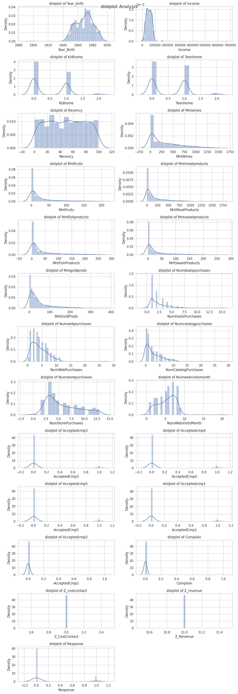
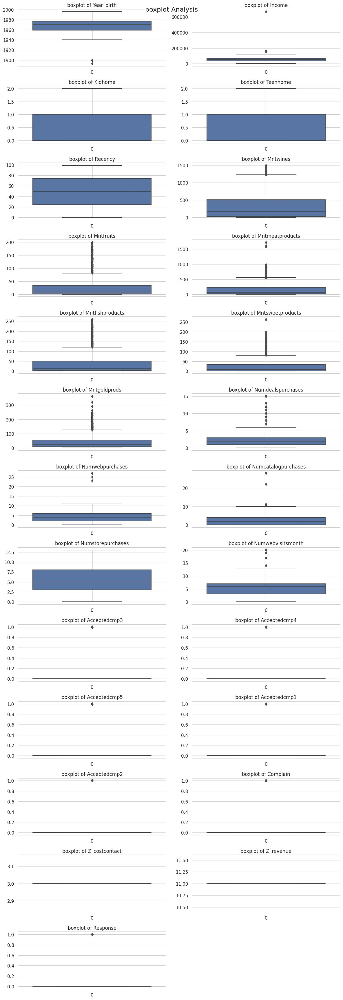
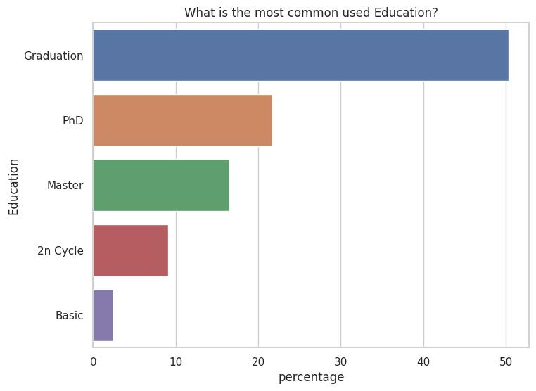
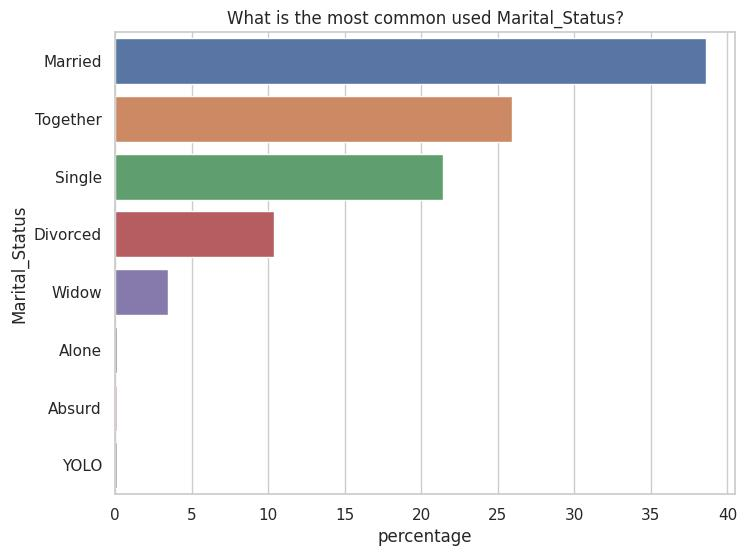
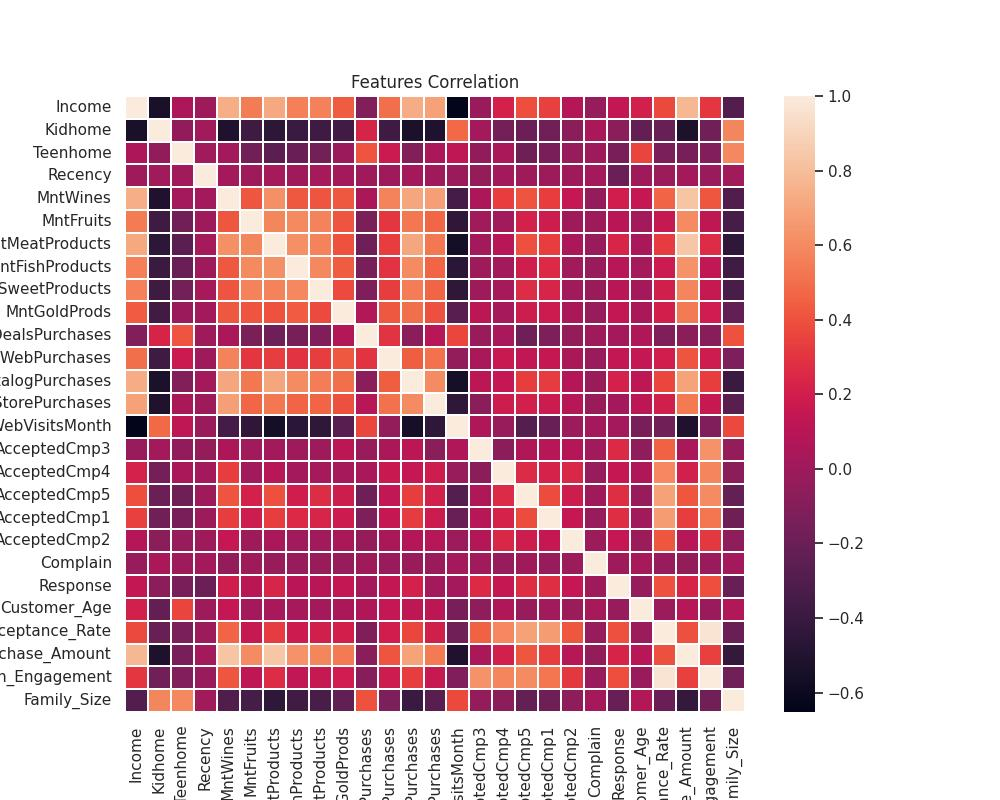

# Analysis Report: Customer Personality Analysis for Segmentation

## Table of Content
- [Analysis Report: Customer Personality Analysis for Segmentation](#analysis-report-customer-personality-analysis-for-segmentation)
  - [Table of Content](#table-of-content)
  - [Introduction](#introduction)
  - [Data Overview](#data-overview)
  - [Data Preprocessing](#data-preprocessing)
  - [Analysis Insights](#analysis-insights)
    - [Individual Features Analayis of raw data](#individual-features-analayis-of-raw-data)
    - [Boxplot for each numeric features](#boxplot-for-each-numeric-features)
    - [The Most Common \[Education, Marital Status \]level](#the-most-common-education-marital-status-level)
    - [What is the most bought product?](#what-is-the-most-bought-product)
    - [Purchase Behaviour over Education Level](#purchase-behaviour-over-education-level)
    - [Demographic Factors for Cutomers Purchases Behaviour](#demographic-factors-for-cutomers-purchases-behaviour)
    - [Purchase Behaviour over Education Level](#purchase-behaviour-over-education-level-1)
    - [Customer LifeTime Value (CLV)](#customer-lifetime-value-clv)
    - [What is the most Impactfull Compaign?](#what-is-the-most-impactfull-compaign)
    - [Distribution of Purchases over Various Channels](#distribution-of-purchases-over-various-channels)
    - [Customer Recency Analysis](#customer-recency-analysis)
      - [Exploring over different features](#exploring-over-different-features)
  - [Feature Engineering](#feature-engineering)
    - [Features Correlation](#features-correlation)
  - [Dimentionality Reduction](#dimentionality-reduction)
    - [Variance Explained by Each Component](#variance-explained-by-each-component)
  - [Model Insights](#model-insights)
    - [Determining the number of clusters](#determining-the-number-of-clusters)
    - [Model Pipeline](#model-pipeline)
  - [Customers Clusters](#customers-clusters)
  - [Clustering Profiling](#clustering-profiling)
  - [Recommendations](#recommendations)
  - [Conclusion](#conclusion)

## Introduction
The aim of this analysis report is to provide insights into the process of customer segmentation in the context of company business model. As a company specializing in managing market for customers, accurately determining the customers clusters for properties is crucial for understanting its customers and maintaining competitive advantage in the market.

Segmentation of customers involves considering various factors, such as the demographic features of customers like their age, education either thery are undergrad, grad, or post-grad, thier marital status, their family construction, the recency to know how may day since customer's last purchase, their purchases categories, and promos interactions. By analyzing these factors and the market dynamics, we can develop a clustering strategy that aligns with customer expectations and market trends.

Through this analysis, we aim to gain insights into the key factors influencing customer segmentation, identify patterns or trends in the market, and develop a data-driven approach that aligns with customer expectations and the competitive landscape. By leveraging the power of data science and statistical techniques, we can enhance our decision-making process and optimize our clustering strategy for customers segmentation.

The following sections of this report will go into the details of the analysis, including data preprocessing, descriptive statistics, correlation analysis, feature importance, provide recommendations based on the findings for the company.

## Data Overview
The analysis is based on given dataset that contains information relevant to the customers behaviour for the segmentation target.

The dataset includes the following columns:
|Feature|Description|Type|
|--|--|--|
|'ID'| Customer’s unique identifier | int64|
|'Year_Birth'| Customer's birth year| int64|
|'Education'| Education Qualification of customer| object|
|'Marital_Status'| Marital Status of customer| object|
|'Income'| Customer's yearly household income| int64|
|'Kidhome'| Number of children in customer's household | int64|
|'Teenhome'|Number of teenagers in customer's household | int64|
|'Dt_Customer'| Date of customer's enrollment with the company| timestamp|
|'Recency'| Number of days since customer's last purchase| int64|
|'MntWines'| Amount spent on wine| int64|
|'MntFruits'| Amount spent on fruits| int64 |
|'MntMeatProducts'| Amount spent on meat products | int64|
|'MntFishProducts'| Amount spent on fish products| int64|
|'MntSweetProducts'| Amount spend on sweets products| int64 |
|'MntGoldProds'| Amount spend on gold products| int64 |
|'NumDealsPurchases'| number of purchase deals| int64|
|'NumWebPurchases'| Number of purchases made through the web| int64|
|'NumCatalogPurchases'|Number of purchases made through catalogs | int64|
|'NumStorePurchases'| Number of purchases made in physical stores| int64|
|'NumWebVisitsMonth'|Number of web visits in a month | int64|
|'AcceptedCmp1'| Whether the customer accepted Marketing Campaign 1| int64|
|'AcceptedCmp2'| Whether the customer accepted Marketing Campaign 2| int64|
|'AcceptedCmp3'| Whether the customer accepted Marketing Campaign 3| int64|
|'AcceptedCmp4'| Whether the customer accepted Marketing Campaign 4| int64|
|'AcceptedCmp5'|Whether the customer accepted Marketing Campaign 5 | int64|
|'Complain'| Whether the customer has made a complaint | int64|
|'Z_CostContact'| Cost associated with contacting the customer | int64|
|'Z_Revenue'| Revenue associated with contacting the customer| int64|
|'Response|  Customer's response to the company's offer| int64|

## Data Preprocessing
Before conducting the analysis, several preprocessing steps were performed on the dataset. 

The dataset we have, was mostly clean and does not have much to preprocess, as the dataset raw analysis shows that:
- there were no duplicated records regarding the customers ID
- There are low percentage of missing values in 'Income' feature, which require handling illustrated below.

These steps included:

1- __Handling missing values__ in both numerical and categorical features, could be handeled using one of the following:
  - Remove the records which contains missing values, as they represent small percentage in the dataset.
  - Fill missing values by statistical method like [mean, mode].
  - Regression impuration for these values depending on available features.
- Filteration Note: 
   - Deciding which method to use, depends on the other features, to make sure if we decide to drop these records, it will not affect certain category and lower its records percentage.
  - So the model will be baised to certain category value, as it didn't have much data to train enough for the dropped category.

There are little percentage of records which will be lost in property_type: Income, which encourge us to simply remove the records containing missing values.

2- __Filtering outliers__ based on relevant features.
There are possible outliers in featuers: [Income, Mntwines, Mntfishprods, Mntsweetprods, Mntgoldprods, Numwebpurchases, Numcatelogpurchases, Numwebvisitsmonth]

As we are interested in customer segmenation, we should first see the percentage of the records that considered as outliers before jumping to remove it.

## Analysis Insights
### Individual Features Analayis of raw data

Exploring the distribution plots of each features, we concolude the following insights:
|Feature|Insights|
|--|--|
|Year_Birth| Most of the data distribution is located between years 1940 till 2000, and there are some outliers in the data should be removed.
|Income| Right skewed feature, owing the fact that there are high values of income which require invistigating to consider it outliers.
|Recency| represent uniform distribution
|Mntwines, Mntfruits, Mntmeatproduct, Mntfishproducts, mntsweetproducts, Mntgoldprods| These features have same right skewed distribution, which high percentage of zeros value.
|Numberwebvisitsmonth| Most of the distribution between [0 to 10] visits per month, but there are extreme values require investigating.
|Acceptedcmp Features| all 5 features has a similar distribution, they are consisting of two values of zeros and ones, and the majority is zeros which leads to imbalanced features.
|Z_costcontact|Constant value of 3$ which represent a uniform value in the all dataset. Since this column has no variability, it doesn't provide any distinguishing information within the dataset.
|Z_revenue| Constant value of 11$ which is similiar to the previous features in the insight.
|Response|The majority of the data are zeros, but still there are a small percentage of ones. 

To conclude:
- Some features require some investegating to be confident that there are outliers to be removed.
- Majority of customers do not buy most of the products, since majority of values are zeros in features related to products bought by customers.
- Value of cost and revenue do not have huge impact in our objective of customer clustering, for the reason that they have constant values.

### Boxplot for each numeric features
Before Cleaning

There are possible outliers in featuers: [Income, Mntwines, Mntfishprods, Mntsweetprods, Mntgoldprods, Numwebpurchases, Numcatelogpurchases, Numwebvisitsmonth]

As we are interested in customer segmenation, we should first see the percentage of the records that considered as outliers before jumping to remove it.

According to this percentage, we can drop outliers in the following features: [Income, MntWines, NumCatalogPurchases, NumWebVisitsMonth]

### The Most Common [Education, Marital Status ]level

From these figures, we can conlude the following insights:
- For Education level feature, the majority of customers are graduates, some partion of them have post-grade studies, and a small partion of customers are still ungrad.
- For Marital_Status, we have little data for three types of status which are [Alone, Absurd, YOLO]. Regarding the status [Absurd, YOLO] actually do not have a variale meaning related to marital status, we will convert these status to only two types [Partner, Alone], where 'Partner' if the status is either 'married' or 'together', otherwise we will replace it with 'alone' as status.
- Some required features engineering to merge the education levels into three distinct levels like [ungrad, grad, postgrad], and tha same for matital status to be like [Alone, Partner].

### What is the most bought product?
To have a better understanding of the customer purchases behaviour, we need to see what are the most common bought products in the market.

It was shown that Wines and meat products the top purchases products in our dataset.

### Purchase Behaviour over Education Level

Insights shown from the figure:
- The most purchased products are Wines and Meats
- Customers with Postgraduate level tends to buy more wines that the others.
- The higher the level of education the more tends to buy wines and meats.
- Error Bars [Vertical black lines] are graphical representation of the variability of data an used on graphs to indicate the error or uncertainty in a reported measurements. So they are set to 95% of error.
  
### Demographic Factors for Cutomers Purchases Behaviour

Insights shown from the figure:
- The demographic insights on the education level indicate that there are customers who tends to buy more in every products based on the outliers dots shown in the above figure, which could be cluster on their own.
- In each product, the central of tendency (median) are low which represent huge number of customers buying each type of products with a huge quantaties.

### Purchase Behaviour over Education Level

Insight: 
- There are similarity between both products pruchases distribution over the Marital Status either you are Alone or living with a partner.

### Customer LifeTime Value (CLV)
In this analysis, we will calculate the CLV for each customer based on their historical behavior, spending, and acceptance of campaigns, To gain insights about the average value for each accepted campaing.

From the statistal analysis it was discovered that: 
- Percentage of high value customers= 2.659822678488101
- Average CLV for customers who accepted AcceptedCmp1: 747.2110384449439
- Average CLV for customers who accepted AcceptedCmp2: 601.3314475224347
- Average CLV for customers who accepted AcceptedCmp3: 354.84102747514765
- Average CLV for customers who accepted AcceptedCmp4: 549.0107049479552
- Average CLV for customers who accepted AcceptedCmp5: 813.3303528850739

Insights:
- The CLV metric tells us the net profit a company expects to earn from a customer over the entire duration of their relationship. CLV indicates the total expect revenue a company can earn from a customer throughout this duration.
- The Top highest CLV value is due to Compaign #5 then number #1.

### What is the most Impactfull Compaign?

Insight:
- The top highest purchased was due to marketing campaign number 3, the lowest was due to campaign number 2.
- Although in markering campaign from the "Average CLV by Marketing Campaign" figure, has the lowest CLV, which push the customers to buy, as the CLV is suitable for them to make them buy.
  
### Distribution of Purchases over Various Channels

Insights: 
- The most higher used channel for purchases is through the Store, where most of the purchases are around 4 to 7 purchases per customer.
- Number of customers purchases in each channel varies, like in Web where the distribution of data is wider around 2 to 3 purchases where there are higher concentration, in Store channel where the the higher conectration of the data is around 3 to 5 purchases by customers, and in Catalog where the high concentration is around 0 to 1 purchases by customers. 

### Customer Recency Analysis
Recency represents the number of days since a customer's last purchase, which is a key metric in understanding the customer engagment and retention. This analysis should provide us some insights into customer behaviour.

The distribution looks like a uniform distribution, where there is no distinct pattern of customers recency.

#### Exploring over different features

## Feature Engineering
Creating additional informative feature will have huge impact in model training process. So the recommened features to engineered are:

|Feature|Description|
|--|--|
Customer_Age|Calculating the customer age would provide us with demographic feature for segmentation. 
Total_Spending|This feature reprenests the total amound spend by each customer on all products categories. This can indicate a customer's overall purchasing behavior.
Total_Purchases|Calculating the total number of purchases made by each customers across all channels.
Acceptance_Rate|Calculating the acceptance rate of marketing campaigns for each customer.  This could be the sum of accepted campaigns divided by the total number of campaigns.
Channel_Preference|Determine a customer's preferred channel based on the highest number of purchases among different channels.
Avg_purchase_Amount|Calculating the average purchase amount for each customer by dividing the total spending by the total number of purchases
Campaign_Engagement|Creating a feature that sums the accepted campaigns and weights them by campaign importance or cost, giving more weight to campaigns that generated higher revenue.
Living_With| Converting the Marital Status into meaningfull description.
Num_children|This feature represents the number of children are in the home of each customers.
Family_Size|This feature represents the total member in the house.

### Features Correlation

## Dimentionality Reduction
In our dataset, the current features are large, and still we have some highly correlated features after manually removing them, So in the next step we will use PCA "Principal Component Analysis" for dimensionality reduction.

To estimate the best number of components for our features, we use elbow diagram that calculate the cumulative explained variance value based on the each features.

We can go for 7 principle components, which would give us around 70% of the explained variance of our dataset.

### Variance Explained by Each Component
Each value in the explained_variance_ratio_ array represents the proportion of variance explained by one of the six principal components. 

Based on the used number of princple components, the calculated explained variance of each component was as the following:

[0.31834665 0.12702351 0.07595886 0.04848242 0.03978779 0.03653919
 0.03387683]

This would indicates the following:
- The first principal component (PC1) explains approximately 31.83% of the total variance.
- The second principal component (PC2) explains approximately 12.7% of the total variance.
- The third principal component (PC3) explains approximately 7.59% of the total variance.
- And so on for the remaining components.
  
## Model Insights
For customers segmentaiotn task, we have many option for clustering algorithms available suitable for our case based on our dataset and features we have, which are [KMeans, Agglomerative Hierachical] algorithms.

Algorithm|	Data Distribution|	Number of Clusters|	Scalability|	Interpretability|	Outlier Handling|	Robustness to Noise|	Cluster Shape|	Non-Euclidean Distances|	Hierarchical vs. Partitional|	Domain Knowledge|
|--|--|--|--|--|--|--|--|--|--|--|
|K-Means|	Assumes spherical|	Requires pre-defined K|	Scalable|	Easy to interpret|	Sensitive to outliers|	Not robust|	Assumes convex|	Supports custom distances|	Partitional|	Widely used| 
|Agglomerative Hierarchical|	Does not assume specific shape|	Hierarchical hierarchy|	Moderate scalability|	Hierarchical structure|	No explicit outlier handling|	Moderate robustness|	Handles non-convex|	Supports custom distances|	Hierarchical|	Hierarchical clustering|

### Determining the number of clusters

we can go for 4 clusters for our customers segmentation process.

### Model Pipeline

## Customers Clusters
Based on the used features, and paramaters the resulted clusters, the output customers clusters of the first two principle compoents are shown in the following figure.

For other different paris of used principle components:

## Clustering Profiling
To profile each cluster to get known of its specs, we can visualize each cluster based on some of features like: [ Kidhome, Teenhome, Customer_Age, Num_Children, Family_Size, Education,Living_With, Channel_Preference]

The visualization as follows:

We can colclude the following profiles:
|Cluster|Specs|
|--|--|
|__Cluster 0__|Heavy purchases customers. Use all the purchases channels. Postgraduate and graduate education level customers. Family size is between 1 to 3 members. Living Alone, in couples, and could have only one child.  Definitely Don't Have kids, but have a teenager.
__Cluster 1__|Light purchases customers. They use all the purchases channels. Includes all education level Family size is between 2 to 4 members. Living with Partaner, and could have one to two childers. Could have up to 2 kids in their family.
__Cluster 2__|Moderate purchases customers Prefere to go to store to buy their procduts. Graduate customers Family size is 2 members. Most of them are living with partners. Definitely Don't Have kids, but have a teenager.
|__Cluster 3__|Heavy purchases customers. Prefere both store and web to buy their procduts. Postgraduate and graduate education level customers. Family size is between 2 to 4 members. Living with Partaner, and could have one to two childers. Could have only one kid in their family.

## Recommendations
Based on the analysis conducted, the following recommendations are suggested:
- Tailored Marketing Strategies: Customize marketing strategies and product offerings for each customer segment based on their unique characteristics and preferences.
- Customer Engagement: Develop engagement strategies to target specific behavior patterns and interests within each segment.
- Product Development: Use insights from customer segmentation to inform product development decisions, ensuring that products align with the needs of different segments.
- Personalization: Implement personalized marketing campaigns to enhance customer engagement and loyalty.
  
## Conclusion
In conclusion, Customer Personality Analysis and segmentation provide valuable insights that can drive business success. By understanding the distinct traits, behaviors, and preferences of different customer segments, businesses can create tailored strategies to attract, retain, and engage customers effectively. This analysis report serves as a foundation for data-driven decision-making and helps businesses optimize their marketing and product development efforts in line with customer expectations and market trends.